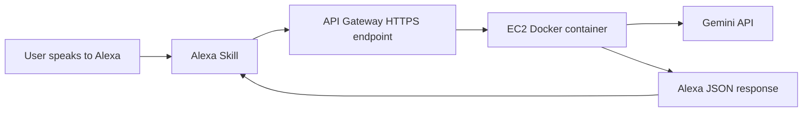

<p align="center">
  
</p>

<h1 align="center">Alexa Q&A Skill</h1>

<p align="center">
  Full code to deploy your own Alexa skill backend with Docker, AWS EC2, API Gateway, ECR, and Gemini.
</p>

<p align="center">
  
  
  
  
</p>

## Repository Overview

This repo contains everything needed to run an Alexa skill backend on your own AWS account.

It covers:

1. Creating a custom Alexa skill in the Amazon Developer Console
2. Adding an invocation name and sample phrases
3. Configuring the skill endpoint
4. Creating an API Gateway in AWS
5. Hosting the backend on EC2
6. Getting a Gemini API key from Google Cloud
7. Building and pushing the Docker image to Amazon ECR
8. Pulling and running the container on EC2

## Architecture



## Prerequisites

You need:

1. An AWS account
2. An Amazon Developer account
3. AWS CLI installed and configured
4. Docker installed locally
5. An EC2 key pair
6. A Gemini API key
7. Your backend code in this repo

## 1. Create the skill in Alexa Developer Console

1. Go to the Alexa Developer Console
2. Click **Create Skill**
3. Enter a skill name, for example `Mini Link`
4. Choose **Custom**
5. Continue with your preferred hosting option, because this repo hosts the backend itself
6. Create the skill

## 2. Add the invocation name

Set an invocation name users can say naturally.

Examples:

1. `mini link`
2. `smart helper`
3. `home assistant bot`

## 3. Add intents and phrases

Create a custom intent:

1. Intent name: `AskAgentIntent`
2. Slot name: `question`
3. Slot type: `AMAZON.SearchQuery`

Example utterances:

1. `ask {question}`
2. `question {question}`
3. `tell me {question}`
4. `search for {question}`
5. `help me with {question}`

Keep these built in intents too:

1. `AMAZON.HelpIntent`
2. `AMAZON.CancelIntent`
3. `AMAZON.StopIntent`
4. `AMAZON.FallbackIntent`

After editing:

1. Click **Save Model**
2. Click **Build Model**

## 4. Get a Gemini API key

Create or select a Google Cloud project and generate a Gemini API key.

## 5. Necessary .env variables

Copy `.env.example`

Add all the necessary keys

Save file as `.env`

## 6. Create an ECR repository

Create a private ECR repository:

```bash
aws ecr create-repository --repository-name alexa-skill --region eu-central-1
```

Repository URL format:

```text
<AWS_ACCOUNT_ID>.dkr.ecr.eu-central-1.amazonaws.com/alexa-skill
```

## 7. Build and push Docker

Log in to ECR:

```bash
aws ecr get-login-password --region eu-central-1 | docker login --username AWS --password-stdin <AWS_ACCOUNT_ID>.dkr.ecr.eu-central-1.amazonaws.com
```

Build the image:

```bash
docker build --platform linux/amd64 -t alexa-skill .
```

Tag the image:

```bash
docker tag alexa-skill:latest <AWS_ACCOUNT_ID>.dkr.ecr.eu-central-1.amazonaws.com/alexa-skill:latest
```

Push the image:

```bash
docker push <AWS_ACCOUNT_ID>.dkr.ecr.eu-central-1.amazonaws.com/alexa-skill:latest
```

Use the same commands every time you deploy a new version.

## 8. Launch an EC2 server

Create an EC2 instance in AWS.

Recommended setup:

1. Name: `Alexa-Skill-Server`
2. OS: Amazon Linux 2023
3. Instance type: use a Free Tier eligible micro instance where available
4. Public IP: enabled
5. Security group:
   1. Allow SSH from your own IP
   2. Allow HTTP from the internet on port 80

In **User Data**, paste:

```bash
#!/bin/bash
yum update -y
yum install -y docker
service docker start
usermod -a -G docker ec2-user
```

After the instance is running:

1. Keep the `.pem` file safe
2. Copy the EC2 public IPv4 address

## 9. SSH into EC2

Secure the key:

```bash
chmod 400 alexa-key.pem
```

Connect:

```bash
ssh -i alexa-key.pem ec2-user@<EC2_IP>
```

## 10. Create the deploy script

Create `deploy_config/up.sh`:

```bash
#!/bin/bash
set -euxo pipefail

aws ecr get-login-password --region eu-central-1 | docker login --username AWS --password-stdin <AWS_ACCOUNT_ID>.dkr.ecr.eu-central-1.amazonaws.com

REPO="<AWS_ACCOUNT_ID>.dkr.ecr.eu-central-1.amazonaws.com/alexa-skill"

docker pull $REPO:latest
docker stop alexa_skill || true
docker rm alexa_skill || true

docker run -d \
  --name alexa_skill \
  --restart always \
  -p 80:80 \
  --env-file .env \
  $REPO:latest
```

## 11. Copy `.env` and `up.sh` to EC2

Your `.env` must also exist on the EC2 server because Docker uses it there.

Copy `.env`:

```bash
scp -i alexa-key.pem deploy_config/.env ec2-user@<EC2_IP>:~/.env
```

Copy `up.sh`:

```bash
scp -i alexa-key.pem deploy_config/up.sh ec2-user@<EC2_IP>:~/up.sh
```

Run it remotely:

```bash
ssh -i alexa-key.pem ec2-user@<EC2_IP> "chmod +x up.sh && ./up.sh"
```

Your container should now be running on EC2 port 80.

## 12. Create API Gateway

Go to **API Gateway** in AWS and create an **HTTP API**.

Use these values:

1. Integration type: HTTP
2. Backend URL: `http://<EC2_IP>:80`
3. Method: `POST`

Create a route:

```text
POST /alexa
```

Deploy using the default stage.

After creation you will get an invoke URL like:

```text
https://<API_ID>.execute-api.<REGION>.amazonaws.com
```

Your final Alexa endpoint becomes:

```text
https://<API_ID>.execute-api.<REGION>.amazonaws.com/alexa
```

## 13. Add the endpoint in Alexa Developer Console

In Alexa Developer Console:

1. Open your skill
2. Go to **Endpoint**
3. Choose **HTTPS**
4. In **Default Region**, paste:

```text
https://<API_ID>.execute-api.<REGION>.amazonaws.com/alexa
```

5. Save endpoints

## 14. Backend route

Your backend should accept:

```text
POST /alexa
```

Example FastAPI route:

```python
from fastapi import APIRouter, Request

router = APIRouter()

@router.post("/alexa")
async def alexa_endpoint(request: Request):
    body = await request.json()
    return {
        "version": "1.0",
        "response": {
            "outputSpeech": {
                "type": "PlainText",
                "text": "Hello from your Alexa backend"
            },
            "shouldEndSession": True
        }
    }
```

## 15. Test the endpoint

```bash
curl -v -X POST "https://<API_ID>.execute-api.<REGION>.amazonaws.com/alexa" \
 -H "Content-Type: application/json" \
 -d '{
  "version": "1.0",
  "session": {
    "new": true,
    "application": { "applicationId": "test" },
    "user": { "userId": "test-user" }
  },
  "request": {
    "type": "LaunchRequest",
    "requestId": "test-request",
    "timestamp": "2026-03-18T12:00:00Z"
  }
}'
```

## 16. Deploy updates

Whenever you change the code:

```bash
aws ecr get-login-password --region eu-central-1 | docker login --username AWS --password-stdin <AWS_ACCOUNT_ID>.dkr.ecr.eu-central-1.amazonaws.com

docker build --platform linux/amd64 -t alexa-skill .
docker tag alexa-skill:latest <AWS_ACCOUNT_ID>.dkr.ecr.eu-central-1.amazonaws.com/alexa-skill:latest
docker push <AWS_ACCOUNT_ID>.dkr.ecr.eu-central-1.amazonaws.com/alexa-skill:latest

ssh -i alexa-key.pem ec2-user@<EC2_IP> "chmod +x up.sh && ./up.sh"
```

## Quick start

```bash
aws ecr create-repository --repository-name alexa-skill --region eu-central-1

aws ecr get-login-password --region eu-central-1 | docker login --username AWS --password-stdin <AWS_ACCOUNT_ID>.dkr.ecr.eu-central-1.amazonaws.com

docker build --platform linux/amd64 -t alexa-skill .
docker tag alexa-skill:latest <AWS_ACCOUNT_ID>.dkr.ecr.eu-central-1.amazonaws.com/alexa-skill:latest
docker push <AWS_ACCOUNT_ID>.dkr.ecr.eu-central-1.amazonaws.com/alexa-skill:latest

scp -i alexa-key.pem deploy_config/.env ec2-user@<EC2_IP>:~/.env
scp -i alexa-key.pem deploy_config/up.sh ec2-user@<EC2_IP>:~/up.sh
ssh -i alexa-key.pem ec2-user@<EC2_IP> "chmod +x up.sh && ./up.sh"
```
